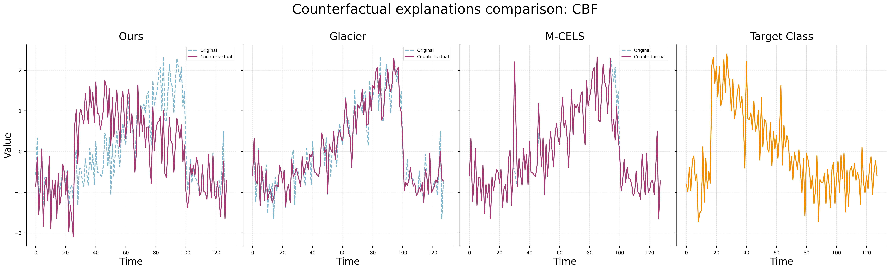

# Time Series Counterfactual Explanations

 

**Goal:** Generate modified time series $X'$ such that $f(X') \neq f(X)$

**Desirable properties:**
- **Validity:** $f(X') = y_{\text{target}}$
- **Proximity:** $X' \approx X$ (minimal changes)
- **Plausibility:** $X'$ realistic within target class
- **Sparsity:** localized modifications

<SlideNumber/>

---

# Dynamic Time Warping (DTW)

**Cost matrix:** $\Delta(X, Y) = [\delta(x_i, y_j)]_{ij} \in \mathbb{R}^{m \times m'}$

**Alignment:** Binary matrix $A \in \mathcal{A}_{m,m'}$ (valid paths from $(1,1)$ to $(m,m')$)

**DTW distance:**

$$\text{DTW}(X, Y) = \min_{A \in \mathcal{A}_{m,m'}} \langle A, \Delta(X, Y) \rangle$$

<figure style="float: right; width: 59%; margin-left: 2em;">
  
  <figcaption style="text-align: center; font-size: 0.8em; margin-top: 0.5em;">
    <a href="https://rtavenar.github.io/blog/dtw.html" target="_blank">Source</a>
  </figcaption>
</figure>

- Handles temporal misalignments
- **Problem:** Non-differentiable

<SlideNumber/>

---

# Soft-DTW

**Soft-minimum operator:**

$${\min}^\gamma\{a_1, \ldots, a_n\} = -\gamma \log \sum_{i=1}^{n} e^{-a_i/\gamma}$$

**Soft-DTW distance:**

$$\text{DTW}^\gamma(X, Y) = {\min}^\gamma \{\langle A, \Delta(X, Y) \rangle : A \in \mathcal{A}_{m,m'}\}$$

 

- $\gamma > 0$ smoothing parameter
- As $\gamma \to 0^+$: converges to standard DTW
- **Differentiable:** enables gradient-based optimization

<SlideNumber/>

---

# Our Method (I)

**Overall objective:**

$$\mathcal{L}_{\text{CF}} = \mathcal{L}_{\text{prox}} + \mathcal{L}_{\text{sparse}} + \lambda \cdot \left(\mathcal{L}_{\text{valid}} + \mathcal{L}_{\text{DTW}}\right)$$

where $\lambda$ controls validity and plausibility weight.

**Proximity loss:**

$$\mathcal{L}_{\text{prox}} = \frac{1}{dT} \|X' - X\|_2^2$$

**Sparsity loss:**

$$\mathcal{L}_{\text{sparse}} = \frac{1}{dT} \|X' - X\|_1$$

**Validity loss:**

$$\mathcal{L}_{\text{valid}} = \max\left(0, \tau - p_f\left(y_{\text{target}}|X'\right)\right)$$

<SlideNumber/>

---

# Our Method (II)

**DTW plausibility loss:**

$$\mathcal{L}_{\text{DTW}} = \frac{1}{k} \sum_{Y \in \mathcal{N}_k(X, y_{\text{target}})} \text{DTW}^\gamma(X', Y)$$

where $\mathcal{N}_k(X, y_{\text{target}})$ is a set of $k$ nearest unlike neighbors from target class.

 

**Key advantage:** Explicit alignment with target class distribution through differentiable soft-DTW.

<SlideNumber/>

---

# Example: CBF Dataset

 

<figure>
  
  <figcaption><FigureNumber/>Comparison of counterfactual explanations on CBF dataset. Our method produces more plausible counterfactuals aligned with target class patterns.</figcaption>
</figure>

<SlideNumber/>
