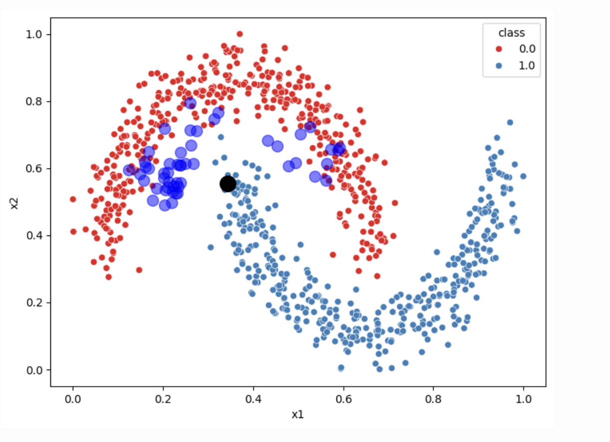

# Energy-Based Models

Energy-based models provide an intuitive framework: we assign an energy value to each possible counterfactual, where lower energy corresponds to better explanations. Think of energy as a cost function – we want counterfactuals that minimize this cost.

We compose multiple objectives into a single energy function:

$$
E(x) = E_{\text{data}}(x) + E_{\text{validity}}(x) + E_{\text{proximity}}(x) + E_{\text{sparsity}}(x)
$$

Each term captures a different desirable property: plausibility (data term), correct prediction (validity), closeness to original (proximity), and minimal changes (sparsity).

This energy defines a target probability distribution via the Boltzmann distribution:

$$
p(z) = \frac{e^{-E(z)}}{\int_{\mathcal{X}} e^{-E(x)}\,dx}
$$

Lower energy means higher probability – the model naturally favors better counterfactuals.

<SlideNumber/>

---

# Energy Function Design

We can construct the energy using concrete terms. For instance:

$$
E(x) = \max(0, \tau_1 - \log p_\theta(x | c')) + \max(0, \tau - p_{\text{clf}}(c' | x)) + \|x - x_0\|_2 + \|x - x_0\|_1
$$

Breaking this down:
- **First term** ($\max(0, \tau_1 - \log p_\theta(x | c'))$): Penalizes implausible counterfactuals. Here $\log p_\theta(x | c')$ is a conditional log-likelihood from a normalizing flow, measuring how realistic $x$ is for class $c'$.
- **Second term** ($\max(0, \tau - p_{\text{clf}}(c' | x))$): Ensures the classifier predicts the desired class $c'$ with sufficient confidence.
- **Third and fourth terms** ($\|x - x_0\|_2 + \|x - x_0\|_1$): Keep the counterfactual close to the original instance, combining L2 distance for overall proximity and L1 for sparsity.

The $\max(0, \cdot)$ construction creates soft constraints – violations incur energy penalties.

<SlideNumber/>

---

# Generating Counterfactuals: Langevin Dynamics

Once we have defined the energy function, how do we find good counterfactuals? We use Langevin dynamics, an iterative sampling algorithm:

$$
x_{i+1} = x_i - \eta \nabla E(x) + \sqrt{2 \eta}\,\varepsilon_i, \quad \varepsilon_i \sim \mathcal{N}(0, I_d), \,d=\dim(x)
$$

This update rule has two components:
- **Gradient descent** ($-\eta \nabla E(x)$): Pulls the current point toward lower energy regions
- **Noise injection** ($\sqrt{2 \eta}\,\varepsilon_i$): Adds stochastic exploration to avoid local minima

Starting from the original instance $x_0$, we iteratively apply this update. The process naturally balances exploitation (following the energy gradient) with exploration (random noise), eventually converging to high-quality counterfactuals from the target distribution.

<SlideNumber/>

---

# Energy-Based Models: Example

<figure>
  
  <figcaption><FigureNumber/>Counterfactual explanations generated using energy-based models.</figcaption>
</figure>

<SlideNumber/>
