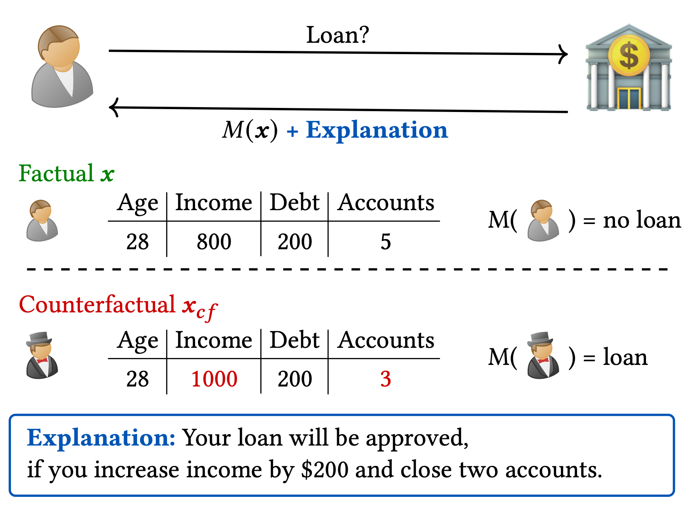
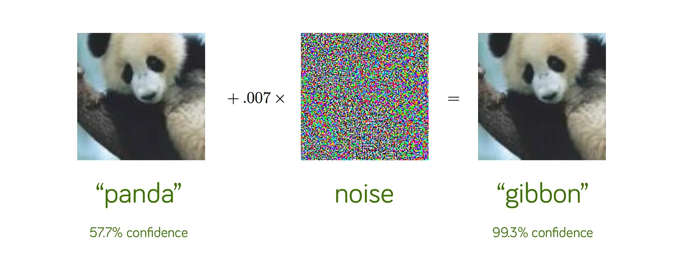

# Definition

A **counterfactual explanation** describes how a model's input should be minimally modified to achieve a desired prediction [@Guidotti2022CounterfactualEA].

Given:
- An instance $\mathbf{x}$ with prediction $f(\mathbf{x}) = y$
- A desired outcome $y'$

Find $\mathbf{x}'$ such that:
- $f(\mathbf{x}') = y'$ (achieves the target)
- $\mathbf{x}'$ is close to $\mathbf{x}$ (minimal change)

<SlideNumber/>

---

# Example

<figure>
  
  <figcaption><FigureNumber/>Counterfactual explanation for a loan application: minimal changes to achieve approval.</figcaption>
</figure>

<SlideNumber/>

---

 
 
 

What makes a good counterfactual explanation?

<SlideNumber/>

---

## Validity

The counterfactual must actually produce the desired outcome:

$$f(\mathbf{x}') = y'.$$

This is a hard constraint that must be satisfied.

<SlideNumber/>

---

## Sparsity

Minimize the number of features that differ from the original instance.

$$\|\mathbf{x} - \mathbf{x}'\|_0 = \sum_{i=1}^{n} \mathbb{1}_{x_i \neq x'_i}$$

Or using $L_1$ norm as a continuous relaxation:

$$\min \|\mathbf{x} - \mathbf{x}'\|_1 = \sum_{i=1}^{n} |x_i - x'_i|$$

Fewer changed features make explanations easier to understand and act upon.

<SlideNumber/>

---

## Proximity

Minimize the distance between the original and counterfactual instances.

For continuous features, typically using $L_2$ norm:

$$\min \|\mathbf{x} - \mathbf{x}'\|_2 = \sqrt{\sum_{i=1}^{n} (x_i - x'_i)^2}$$

For discrete features:
- **Hamming distance**: count of differing positions
- **Gower distance**: normalized distance handling mixed data types

<SlideNumber/>

---

## Plausibility

The counterfactual should represent a realistic instance.

- Respect feature correlations
- Stay within valid feature ranges
- Reflect real-world constraints

Example: setting education level to "PhD" while keeping age at 18 is implausible.

<SlideNumber/>

---

## Actionability

Changes should be feasible for the user to implement.

- **Actionable**: income, education level, loan amount
- **Non-actionable**: age, gender, race

Domain knowledge determines which features can be modified.

<SlideNumber/>

---

## Diversity

When multiple counterfactuals exist, provide diverse options.

Different users may prefer different paths to the desired outcome.

Example:
- "Increase income by €10,000"
- "Decrease loan amount by €15,000"

<SlideNumber/>

---

## Counterfactuals vs Adversarial Attacks (1)

 
<figure>
  
  <figcaption><FigureNumber/>Adversarial attack example: imperceptible noise causes misclassification [@goodfellow2015explainingharnessingadversarialexamples].</figcaption>
</figure>

<SlideNumber/>

---

## Counterfactuals vs Adversarial Attacks (2)

 

| **Counterfactuals** | **Adversarial Attacks** |
|---|---|
| Explain model behavior | Exploit model vulnerabilities |
| Human-interpretable changes | Often imperceptible changes |
| Plausible instances | Can be unrealistic |
| Support transparency | Aim to deceive |

<SlideNumber/>