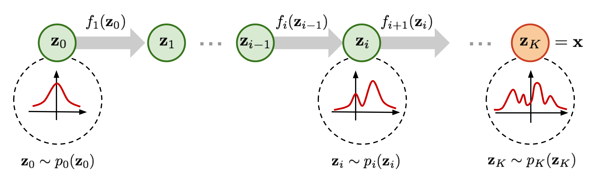

# Plausability

Many counterfactual explanation methods do not include plausibility constraints.

Artelt & Hammer <Cite bref="artelt2020convexdensityconstraintscomputing" /> proposed using Gaussian Mixture Models to enforce plausibility:

$$
\arg\min_{\mathbf{x}'} d(\mathbf{x}_0, \mathbf{x}')
$$
$$
\text{s.t. } h(\mathbf{x}') = y^c, \quad \hat{p}_y(\mathbf{x}') \geq \delta
$$

where $\hat{p}_y(\mathbf{x}') = \log \sum_{k=1}^{K} \pi_k \mathcal{N}(\mathbf{x}' | \boldsymbol{\mu}_k, \boldsymbol{\Sigma}_k)$ is the GMM log-likelihood.

However, Gaussian Mixtures do not model data density perfectly, especially for complex, high-dimensional distributions.

<SlideNumber/>

---

# Normalizing Flows

 
 

<figure>
  
  <figcaption><FigureNumber/>Normalizing flows transform a simple base distribution into a complex target distribution.</figcaption>
</figure>

<SlideNumber/>

---

# PPCEF

Probabilistically Plausible Counterfactual Explanations using Flows <Cite bref="Wielopolski2024PPCEF" />.

We leverage normalizing flows to model data density and integrate this directly into the counterfactual search:

$$
\mathbf{x}' = \arg\min_{\mathbf{x}'} \left[ d(\mathbf{x}_0, \mathbf{x}') + \lambda \left( \ell_v(\mathbf{x}', y') + \ell_p(\mathbf{x}', y') \right) \right]
$$

Validity loss ensures the desired prediction:
$$
\ell_v(\mathbf{x}', y') = \max\left(0.5 + \epsilon - p_d(y'|\mathbf{x}'), 0\right)
$$

Plausibility loss enforces density constraint:
$$
\ell_p(\mathbf{x}', y') = \max\left(\delta - p(\mathbf{x}'|y'), 0\right)
$$

Unlike GMMs, flows accurately capture complex distributions, leading to more realistic counterfactuals.

<SlideNumber/>

---

# PPCEF: Example

<figure>
  
  <figcaption><FigureNumber/>Counterfactual explanation generated using PPCEF.</figcaption>
</figure>

<SlideNumber/>
