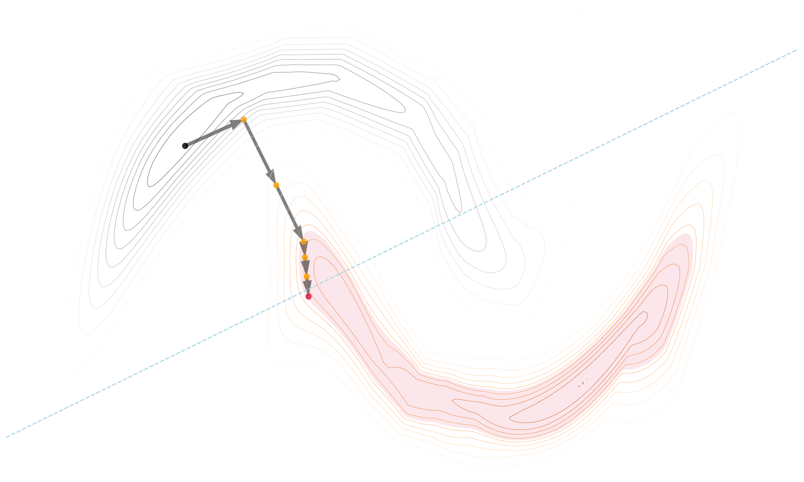

# PPCEF

---

PPCEF [@Wielopolski2024PPCEF]

---

# How the method works?

<!--  -->

<figure>
  
  <figcaption><FigureNumber/>Exemplary countefactual explanation generated using PPCEF.</figcaption>
</figure>

