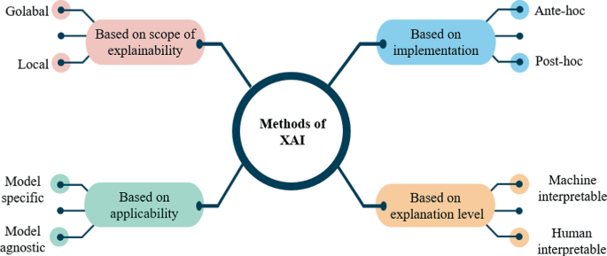

# Explainable AI

Modern machine learning models achieve remarkable performance, yet their decision-making processes remain opaque. This black-box nature creates a fundamental tension: we deploy increasingly complex models while understanding them less.

**Interpretability** refers to the degree to which a human can understand the cause of a decision. Linear models and decision trees are inherently interpretable – their structure directly reveals how inputs map to outputs.

**Explainability** addresses the black-box problem differently. Rather than requiring models to be simple, it provides post-hoc insights into complex models' decisions. We can use sophisticated architectures while still offering meaningful explanations.

The goal of XAI is to make AI systems trustworthy and actionable - enabling users to understand, appropriately trust, and effectively manage AI-driven decisions.

<SlideNumber/>

---

# Methods of XAI

 

<figure>
  
  <figcaption><FigureNumber/>Taxonomy of XAI methods.</figcaption>
</figure>

<SlideNumber/>
